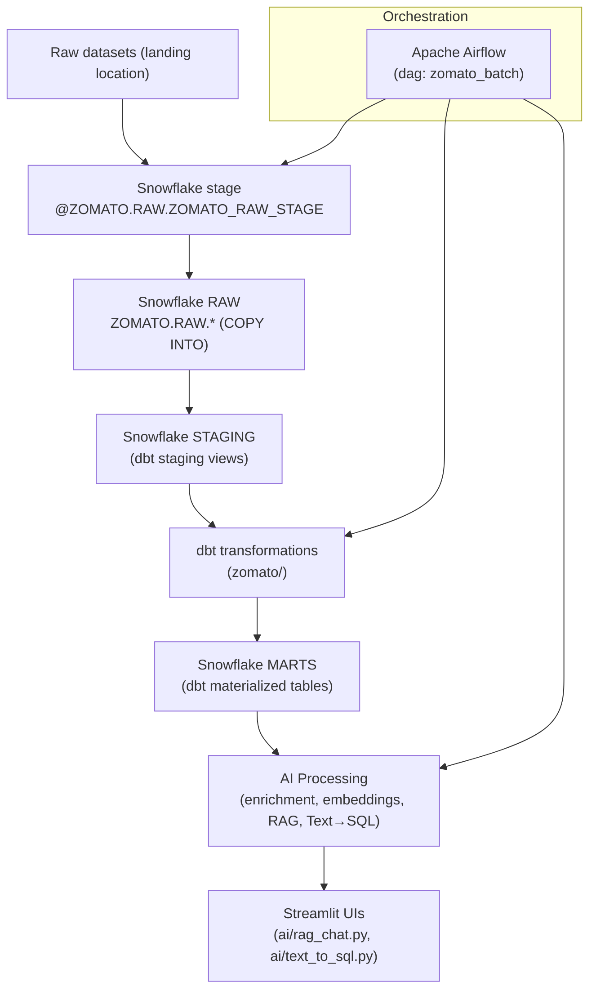

# Zomato Intelligent Data Automation Platform
An end-to-end data engineering, cloud, automation, and GenAI analytics platform for ingesting Zomato datasets, transforming them with dbt in Snowflake, enriching reviews with LLMs, and providing RAG and Text→SQL Streamlit interfaces.

## Project overview
This repository implements a working data pipeline that loads raw datasets into Snowflake (via a Snowflake stage used by COPY INTO), runs dbt transformations to produce staging and marts, enriches reviews with LLMs, and exposes two Streamlit applications for RAG-based review Q&A and natural-language Text→SQL querying. Orchestration is provided by an Airflow DAG (airflow/dags/zomato_batch.py). The AI components use Mistral (mistralai client) in the code; additional provider integrations (Grok/XAI and Gemini) are present or commented for fallback/examples.

## Technology stack
- Python
- Apache Airflow (docker-compose setup in airflow/)
- Docker (Airflow image + compose)
- Snowflake (snowflake-connector used; COPY INTO from a Snowflake stage)
- dbt (zomato/ dbt project; dbt-snowflake listed in requirements)
- Streamlit (ai/rag_chat.py, ai/text_to_sql.py)
- Mistral LLM (mistralai client) — used for embeddings and chat
- Grok (XAI) — present as fallback in code
- (Gemini references present but commented out)
- pandas, numpy

## Actual data flow
The pipeline implemented in this repository follows this flow (the repository uses a Snowflake stage named @ZOMATO.RAW.ZOMATO_RAW_STAGE that the DAG copies from):



Notes:
- The Airflow DAG executes COPY INTO statements that read from the Snowflake stage @ZOMATO.RAW.ZOMATO_RAW_STAGE and populate ZOMATO.RAW tables. The repository does not include explicit AWS S3 or external-stage configuration; if an external stage (S3) is used it must be configured in your Snowflake account outside this codebase.
- dbt materialization settings are defined in zomato/dbt_project.yml (staging -> view, marts -> table).

## Airflow automation
The repository provides an Airflow DAG at airflow/dags/zomato_batch.py (dag_id = `zomato_batch`). Actual task sequence and names (as implemented):

1. `reload_raw` — SQLExecuteQueryOperator using the `snowflake_default` connection. Executes a list of COPY INTO statements to populate ZOMATO.RAW.* tables from the stage @ZOMATO.RAW.ZOMATO_RAW_STAGE.
2. `dbt_build_core` — BashOperator that runs dbt build excluding models tagged with `tag:ai` (core/staging/marts build).
3. `enrich_reviews` — BashOperator that runs `python /opt/airflow/ai/enrich_reviews.py` to classify/enrich reviews and write results to ZOMATO.AI.REVIEW_ENRICHED.
4. `dbt_build_ai` — BashOperator that runs dbt build selecting models tagged `tag:ai` (AI-dependent models).

The DAG links: `reload_raw >> dbt_build_core >> enrich_reviews >> dbt_build_ai`. The Airflow compose file (airflow/docker-compose.yaml) provides a local Airflow setup and injects required environment variables into the containers (SNOWFLAKE_*, MISTRAL_API_KEY, and the Airflow Snowflake connection JSON in environment as shown).

## Snowflake data architecture
The repository targets these Snowflake layers and objects (as used by code and dbt config):
- RAW: ZOMATO.RAW.* tables populated by COPY INTO from @ZOMATO.RAW.ZOMATO_RAW_STAGE (see Airflow DAG).
- STAGING: dbt staging models (zomato/ configured to materialize staging models as views in schema `staging` — see zomato/dbt_project.yml).
- MARTS: analytical tables produced by dbt (configured as `table` materializations in schema `marts`).

The enrichment step writes AI outputs into schema `ZOMATO.AI` (table REVIEW_ENRICHED created by ai/enrich_reviews.py).

## dbt
- Project: zomato/ (zomato/dbt_project.yml present).
- Materializations: staging models configured as `view`; marts configured as `table` (dbt_project.yml).
- The repository includes the models directory scaffold (zomato/models/) — apply your dbt profile (profiles.yml) to connect to Snowflake.

Usage (same commands used in Airflow DAG):

```bash
# core models (exclude AI-tagged models)
dbt build --project-dir zomato --profiles-dir zomato --exclude tag:ai

# AI-dependent models (tagged tag:ai)
dbt build --project-dir zomato --profiles-dir zomato --select tag:ai
```

## AI / GenAI components
All AI components are implemented under ai/.

### LLM review enrichment (ai/enrich_reviews.py)
- Reads reviews from ZOMATO.RAW.REVIEWS (Airflow limits per run via SAMPLE_N in code).
- For each review it produces the following fields and inserts them into ZOMATO.AI.REVIEW_ENRICHED:
  - sentiment_label (positive / negative / neutral)
  - sentiment_score (float between -1.0 and 1.0)
  - topic (one of a small predefined set)
  - key_issue (short phrase up to ~6 words or null)
  - model (string identifying the model used)
- Providers and fallback logic visible in code:
  - Primary implemented provider: Mistral (mistralai client) — classify_with_mistral()
  - Fallback: Grok via an OpenAI-compatible XAI endpoint (classify_with_grok)
  - Gemini-related code is present but commented out; current runtime fallback order in classify_review() tries Mistral, then Grok.

### RAG review analytics (ai/rag_chat.py)
- Reads a sample of reviews from ZOMATO.STAGING.STG_REVIEWS and computes embeddings (EMBEDDING_MODEL = "mistral-embed").
- Embeddings are cached locally to `review_embeddings.parquet` (AI folder).
- Similarity search: cosine similarity between question embedding and review embeddings; selects top-K results.
- LLM answer: constructs a prompt with top review texts and asks the chat model (CHAT_MODEL = "mistral-small-latest") to answer — results presented in a Streamlit app.

### Text→SQL (ai/text_to_sql.py)
- Workflow implemented in code:
  1. User provides a natural-language question in Streamlit.
  2. LLM (Mistral; MODEL = "mistral-small-latest") generates a JSON payload containing a SELECT query.
  3. Safety validation: generated SQL is checked against a FORBIDDEN_WORDS list (drop, delete, truncate, alter, update, insert, create, replace, grant, revoke) and must start with `select` or `with`.
  4. If safe, SQL is executed against Snowflake (schema `MARTS`/dbt outputs) and results are displayed.
- The code explicitly strips schema/database prefixes returned by the model before execution and limits output sizes (dbt/SQL guidance in system prompt).

## Screenshots
The repository contains a Screenshot/ folder. Screenshots are included below in the exact sequence stored in the repository:


> Screenshots are provided as reference for the Streamlit UI and app interactions. Filenames and order are preserved from the repository.

## Dataset
The dataset used for development and testing is available here:

- Google Drive: https://drive.google.com/drive/folders/1_dwsOGOMeiklN4Xi6_wAJoQ7-OuKLnQM

(Use the dataset to populate your Snowflake stage or local test data as appropriate.)

## Repository structure (important folders)
```
ai/                 # LLM scripts, Streamlit apps, embeddings cache
airflow/            # Airflow Dockerfile, docker-compose.yaml, DAGs
zomato/             # dbt project (dbt_project.yml, models/)
Screenshot/          # UI screenshots (preserved filenames and order)
requirements.txt     # minimal requirements (dbt-snowflake)
```

## Setup and running (quick start)
1. Clone
```bash
git clone https://github.com/BaljeetkumarPatel/Zomato-Intelligent-Data-Automation-Platform.git
cd Zomato-Intelligent-Data-Automation-Platform
```

2. Environment variables
- Copy `ai/example.env` to `.env` or set the required environment variables for Snowflake and LLMs. Example variables used in code:
  - SNOWFLAKE_ACCOUNT, SNOWFLAKE_USER, SNOWFLAKE_PASSWORD
  - SNOWFLAKE_WAREHOUSE, SNOWFLAKE_DATABASE, SNOWFLAKE_SCHEMA
  - MISTRAL_API_KEY, XAI_API_KEY (optional)
- dbt requires a `profiles.yml` configured for your Snowflake account (not included in this repo).

3. Airflow (local via docker-compose)
```bash
cd airflow
# copy a filled .env (follow the comments in docker-compose.yaml)
# build and start
docker compose build && docker compose up -d
# Airflow UI: http://localhost:8080 (admin/admin by default in compose comments)
```
The Airflow image mounts the dbt project and ai/ folder into /opt/airflow inside the container as shown in airflow/docker-compose.yaml.

4. Run Streamlit apps locally
- Install dependencies (example):
```bash
python -m venv .venv
source .venv/bin/activate
pip install -r requirements.txt
# install additional packages used by ai/ if not covered by requirements.txt
pip install streamlit mistralai snowflake-connector-python pandas numpy
```
- Start apps:
```bash
streamlit run ai/rag_chat.py
streamlit run ai/text_to_sql.py
```

5. dbt
- From the project root (or inside the environment used by Airflow):
```bash
# core models
dbt build --project-dir zomato --profiles-dir zomato --exclude tag:ai

# AI models (if present)
dbt build --project-dir zomato --profiles-dir zomato --select tag:ai
```

## Security & configuration notes
- Do not commit secrets. Keep `.env`, `ai/example.env` (copy to local .env), and dbt `profiles.yml` out of version control.
- The repository contains example environment variable names; actual credentials (Snowflake, Mistral, etc.) must be provided securely.
- The Text→SQL component implements a simple forbid-list and checks that generated SQL starts with `select` or `with` — treat generated SQL as untrusted and validate in your environment.

## Key features
- Airflow DAG that orchestrates data loading, dbt runs and an LLM enrichment step (`zomato_batch` DAG).
- Snowflake-based RAW → STAGING → MARTS architecture (dbt manages staging and marts materializations).
- LLM-based review enrichment pipeline that writes to ZOMATO.AI.REVIEW_ENRICHED.
- RAG Streamlit app with cached embeddings and cosine-similarity retrieval.
- Text→SQL Streamlit app with LLM-generated SQL and explicit safety checks before execution.

## Project highlights
- End-to-end pipeline spanning ingestion (Snowflake stage + COPY), transformation (dbt), orchestration (Airflow), and AI enrichment (Mistral + fallback).
- Practical safety and operational considerations: SQL safety checks, embedding cache, and Airflow orchestration through docker-compose.

---

If you want, I can now commit this content to README.md in the repository. I will preserve all screenshot paths and not modify other files.