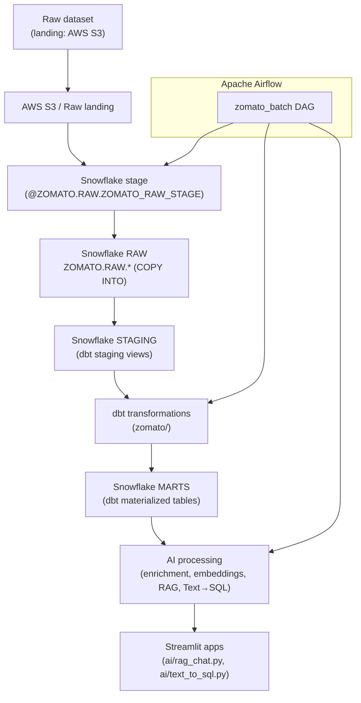

# Zomato Intelligent Data Automation Platform
An end-to-end data engineering, cloud, automation, and GenAI analytics platform for ingesting Zomato datasets, transforming them with dbt in Snowflake, enriching reviews with LLMs, and providing RAG and Text→SQL Streamlit interfaces.

## Project overview
A working pipeline that: places raw datasets in a cloud landing location, exposes them to Snowflake via a stage (used by COPY INTO), transforms data with dbt into staging and marts, enriches reviews using LLMs, and provides interactive Streamlit interfaces for RAG-based Q&A and natural-language Text→SQL. Apache Airflow orchestrates the pipeline (airflow/dags/zomato_batch.py).

## Technology stack
- Python
- Apache Airflow (airflow/docker-compose.yaml, airflow/dags/)
- Docker (Airflow image + compose)
- AWS (S3 landing + IAM policy examples under aws/iam/)
- Snowflake (snowflake-connector usage and COPY INTO in DAG)
- dbt (zomato/ dbt_project.yml)
- Streamlit (ai/rag_chat.py, ai/text_to_sql.py)
- Mistral LLM (mistralai client) — embeddings and chat
- Grok (XAI/OpenAI-compatible) — present as fallback in code
- pandas, numpy

## Actual data flow
The repository implements this pipeline; Airflow orchestrates the automated steps:



Key notes:
- Raw datasets are expected in an S3 landing location (or other cloud storage) and exposed to Snowflake via an external stage. The DAG runs COPY INTO against `@ZOMATO.RAW.ZOMATO_RAW_STAGE` to populate ZOMATO.RAW tables.
- dbt manages staging (views) and marts (tables) per `zomato/dbt_project.yml`.
- AI enrichment runs after core dbt models and writes outputs to `ZOMATO.AI`.

## Airflow automation
Main DAG: `airflow/dags/zomato_batch.py` (dag_id=`zomato_batch`). Implemented task sequence:

1. reload_raw — SQLExecuteQueryOperator (conn_id=`snowflake_default`) executing COPY INTO statements to populate ZOMATO.RAW.* from the Snowflake stage.
2. dbt_build_core — BashOperator: `dbt build --exclude tag:ai` for core/staging/mart models.
3. enrich_reviews — BashOperator: `python /opt/airflow/ai/enrich_reviews.py` (LLM-based enrichment writing to ZOMATO.AI.REVIEW_ENRICHED).
4. dbt_build_ai — BashOperator: `dbt build --select tag:ai` for AI-dependent models.

DAG dependency chain: `reload_raw >> dbt_build_core >> enrich_reviews >> dbt_build_ai`.

The included `airflow/docker-compose.yaml` provides a local Airflow setup and mounts the dbt project and `ai/` scripts into the Airflow container.

## AWS / IAM (what's in this repo)
This repository includes IAM policy and trust-policy examples under `aws/iam/`.

- `aws/iam/s3-read-policy.json` — example IAM policy that allows S3 read access (GetObject, GetObjectVersion, ListBucket, GetBucketLocation) for `arn:aws:s3:::<BUCKET>` and `arn:aws:s3:::<BUCKET>/*`. Replace `<BUCKET>` with your actual bucket name before applying.

- `aws/iam/snowflake-role-trust-policy-initial.json` — example trust policy allowing `arn:aws:iam::<ACCOUNT_ID>:root` to assume a role (placeholder form).

- `aws/iam/snowflake-role-trust-policy-final.json` — example trust policy that allows a specific AWS principal (`<STORAGE_AWS_IAM_USER_ARN>`) to assume role with an `sts:ExternalId` condition (`<STORAGE_AWS_EXTERNAL_ID>`). This reflects a common Snowflake-AWS trust pattern but contains placeholders to be replaced in your environment.

Important:
- These files are templates/examples. Do not deploy them without replacing placeholders and reviewing permissions.
- The repository does not create S3 buckets or Snowflake external stages; these IAM files are provided as deployment references for configuring S3 access and role trust for Snowflake external stages.

## Snowflake data architecture
Layers used by code and dbt:
- RAW — `ZOMATO.RAW.*` populated via COPY INTO from `@ZOMATO.RAW.ZOMATO_RAW_STAGE` (Airflow `reload_raw`).
- STAGING — dbt staging models configured as `view` (see `zomato/dbt_project.yml`).
- MARTS — dbt materialized `table` models in the `marts` schema.
- AI — `ZOMATO.AI.REVIEW_ENRICHED` (created/consumed by `ai/enrich_reviews.py`).

## dbt
- Project: `zomato/` (contains `dbt_project.yml`).
- Materializations (per `dbt_project.yml`): staging models -> `view` (schema `staging`); marts -> `table` (schema `marts`).
- The Airflow DAG runs dbt commands with `--profiles-dir` pointing at the dbt project directory as mounted into Airflow.

Commands used by Airflow / recommended for local runs:
```bash
# core models
dbt build --project-dir zomato --profiles-dir zomato --exclude tag:ai
# ai models
dbt build --project-dir zomato --profiles-dir zomato --select tag:ai
```

## AI / GenAI components
All AI code is under `ai/`.

### LLM Review Enrichment (`ai/enrich_reviews.py`)
- Reads up to `SAMPLE_N` reviews from `ZOMATO.RAW.REVIEWS` that are not present in `ZOMATO.AI.REVIEW_ENRICHED`.
- For each review, the script produces and stores:
  - `sentiment_label` (positive/neutral/negative)
  - `sentiment_score` (float)
  - `topic` (predefined list)
  - `key_issue` (short phrase or null)
  - `model` (model identifier used)
- Provider/fallback logic (as implemented): primary provider is Mistral (`mistralai` client). Grok via an XAI-compatible OpenAI client is implemented as a fallback. Gemini-related code exists but is commented out.

### RAG Review Analytics (`ai/rag_chat.py`)
- Reads a sample from `ZOMATO.STAGING.STG_REVIEWS`.
- Embeddings: `EMBEDDING_MODEL = "mistral-embed"` (Mistral client).
- Embeddings are cached to `ai/review_embeddings.parquet`.
- Retrieval: cosine similarity; selects top-K reviews and asks the chat model (`mistral-small-latest`) to synthesize an answer displayed in Streamlit.

### Text→SQL (`ai/text_to_sql.py`)
- User asks a question in Streamlit.
- LLM (`mistral-small-latest`) generates a JSON response containing a `sql` field with a SELECT query.
- Safety: generated SQL must start with `select` or `with` and must not contain forbidden words (e.g., drop, delete, truncate, alter, update, insert, create, replace, grant, revoke).
- If safe, the SQL is executed against Snowflake (schema `MARTS`) and results displayed; the script strips schema prefixes before execution.

## Screenshots
Included in the repository; sequence preserved below (exact filenames):


## Dataset
- Google Drive: https://drive.google.com/drive/folders/1_dwsOGOMeiklN4Xi6_wAJoQ7-OuKLnQM

## Repository structure (important)
```
ai/                 # LLM scripts and Streamlit apps
airflow/            # Dockerfile, docker-compose.yaml, dags/
aws/                # IAM policy and trust-policy examples (s3-read-policy, snowflake-role-trust)
zomato/             # dbt project (dbt_project.yml, models/)
Screenshot/          # UI screenshots (preserved order)
requirements.txt
README.md
```

## Quick setup & running (concise)
1. Clone
```bash
git clone https://github.com/BaljeetkumarPatel/Zomato-Intelligent-Data-Automation-Platform.git
cd Zomato-Intelligent-Data-Automation-Platform
```

2. Environment variables
- Copy `ai/example.env` to `.env` or set variables in your environment. Key variables referenced in code:
  - `SNOWFLAKE_ACCOUNT`, `SNOWFLAKE_USER`, `SNOWFLAKE_PASSWORD`
  - `SNOWFLAKE_WAREHOUSE`, `SNOWFLAKE_DATABASE`, `SNOWFLAKE_SCHEMA`
  - `MISTRAL_API_KEY`, `XAI_API_KEY` (optional)
- Add a dbt `profiles.yml` for Snowflake (not included).

3. Airflow (local via Docker Compose)
```bash
cd airflow
# populate .env referenced by docker-compose.yaml
docker compose build && docker compose up -d
# Airflow UI: http://localhost:8080
```

4. Run Streamlit apps (local dev)
```bash
python -m venv .venv
source .venv/bin/activate
pip install -r requirements.txt
pip install streamlit mistralai snowflake-connector-python pandas numpy

streamlit run ai/rag_chat.py
streamlit run ai/text_to_sql.py
```

5. dbt (local or container)
```bash
# core models
dbt build --project-dir zomato --profiles-dir zomato --exclude tag:ai
# ai models
dbt build --project-dir zomato --profiles-dir zomato --select tag:ai
```

## Security notes
- Do not commit secrets. Keep `.env`, `ai/example.env` (copy to local .env), and dbt `profiles.yml` out of source control.
- The IAM JSON files under `aws/iam/` are templates and include placeholders — replace them with real ARNs/IDs and review before deployment.
- Treat LLM outputs as untrusted. The Text→SQL module implements a forbid-list and a simple `SELECT/WITH` requirement — review generated SQL before running in production.

## Key features
- Airflow DAG (`zomato_batch`) orchestrates: Snowflake stage COPY → dbt core → LLM enrichment → dbt AI models.
- Snowflake RAW → STAGING → MARTS architecture (dbt manages staging and marts materializations).
- LLM-based review enrichment pipeline writing to `ZOMATO.AI.REVIEW_ENRICHED` (Mistral primary, Grok fallback).
- RAG Streamlit app with cached embeddings and cosine-similarity retrieval.
- Text→SQL Streamlit app with LLM-generated SQL and explicit safety checks before execution.

---

If you want further edits (condensed recruiter summary, expanded setup steps, or adding short run examples), tell me which sections to adjust and I'll update README.md.